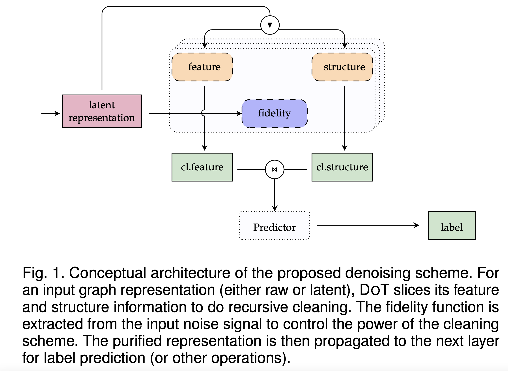

# Graph Denoising with Framelet Regularizer

This repository is the official implementation of [Graph Denoising with Framelet Regularizer]().



## Requirements

To install requirements:

```
pip install -r requirements.txt
```

## All Experiments
To reproduce the results in the paper, you can use the following command

```
python main.py 
```
The key arguments are: --dataset, --filter_type, --attack, and --GConv_type. For example, if you would like to reproduce the result for DoT with GCN on Cora in Table 1, you can run the following command

```
python main.py --dataset Cora --filter_type DoT --attack Mix --GConv_type GCN
```
Other tunable hyperparameters include: --lr, --wd, --nhid, --dropout, --admm_iter, --rho, --lam, etc.


## Citation 
If you consider our codes and datasets useful, please cite:
```

```

## Contributing
Copyright (c) <2020>

Permission is hereby granted, free of charge, to any person obtaining a copy of this software and associated documentation files (the "Software"), to deal in the Software without restriction, including without limitation the rights to use, copy, modify, merge, publish, distribute, sublicense, and/or sell copies of the Software, and to permit persons to whom the Software is furnished to do so, subject to the following conditions:

The above copyright notice and this permission notice shall be included in all copies or substantial portions of the Software.

THE SOFTWARE IS PROVIDED "AS IS", WITHOUT WARRANTY OF ANY KIND, EXPRESS OR IMPLIED, INCLUDING BUT NOT LIMITED TO THE WARRANTIES OF MERCHANTABILITY, FITNESS FOR A PARTICULAR PURPOSE AND NONINFRINGEMENT. IN NO EVENT SHALL THE AUTHORS OR COPYRIGHT HOLDERS BE LIABLE FOR ANY CLAIM, DAMAGES OR OTHER LIABILITY, WHETHER IN AN ACTION OF CONTRACT, TORT OR OTHERWISE, ARISING FROM, OUT OF OR IN CONNECTION WITH THE SOFTWARE OR THE USE OR OTHER DEALINGS IN THE SOFTWARE.
